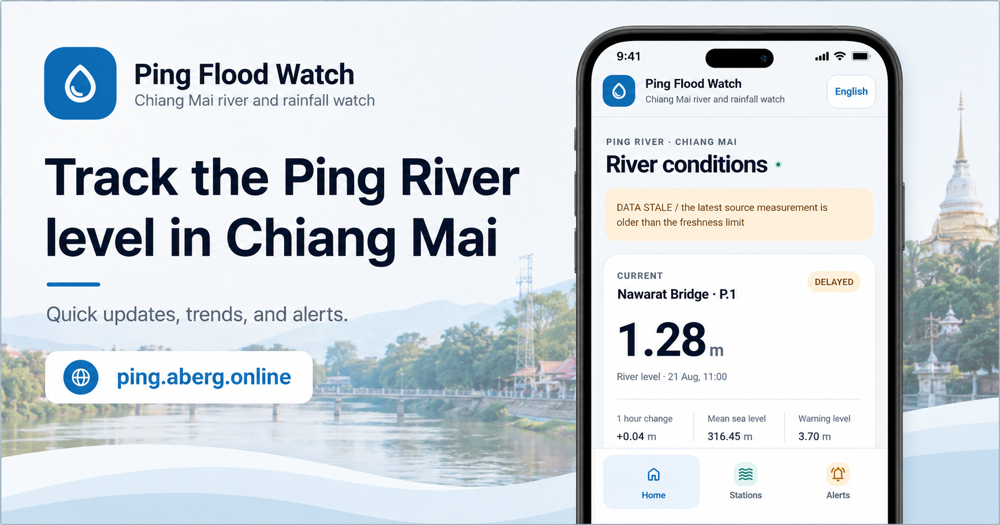

# Ping Flood Watch



Ping Flood Watch är en responsiv PWA som samlar vattenstånd, nederbördsprognoser och varningar för Pingfloden i Chiang Mai. Tjänsten är byggd för att ge en snabb och lättbegriplig lägesbild på mobil och desktop, med P.1 som primär referensstation.

**Live:** [ping.aberg.online](https://ping.aberg.online)

## Funktioner

- Visar aktuella värden, trender och historik för nio stationer längs Pingfloden.
- Kombinerar flodnivåer med regnprognoser för att bedöma översvämningsrisk.
- Interaktiv stationskarta med OpenStreetMap, Leaflet och klustring av markörer.
- Användargränssnitt på engelska och thai.
- Installationsbar PWA med offline-stöd, ljust/mörkt tema och val av hemstation.
- Web Push-notiser för aktiva varningar.
- Hälsokontroller och skyddade bakgrundsjobb för insamling, notifieringar, rensning och backup.

## Datakällor

| Källa | Användning |
| --- | --- |
| ThaiWater | Primära vattennivåer för bland annat P.67, P.103 och P.1. |
| CMFlood / Chiang Mai University | Kompletterande upp- och nedströmsstationer. |
| Open-Meteo | Nederbördsprognoser och väderrisk. |
| OpenStreetMap | Bakgrundskarta på stationssidan. |

Mer om datavalidering, stationer och integritet finns i [docs/PROVIDERS.md](docs/PROVIDERS.md).

## Teknik

- PHP 8.2+ (PHP 8.3 rekommenderas i produktion)
- MariaDB 10.11+
- Apache 2.4, Composer 2 och Node.js 22
- Guzzle, Minishlink Web Push, Leaflet, Chart.js och Playwright

## Kom igång lokalt

1. Klona repot och gå till projektmappen.
2. Installera PHP- och JavaScript-beroenden.
3. Skapa en lokal konfiguration från exemplet och ange egna, lokala databasuppgifter.
4. Bygg webbresurser och kör databasmigreringar i en avsedd utvecklingsdatabas.

```bash
git clone https://github.com/ProjektKhaos/ping.git
cd ping
composer install
npm ci
cp app/config.example.php app/config.local.php
npm run assets
```

`app/config.local.php` och `.env` är medvetet ignorerade av Git. Lägg aldrig in databaslösenord, VAPID-nycklar eller annan produktionskonfiguration i repot.

För komplett installation, Apache-konfiguration, databasprovisionering och produktionsdrift, se [docs/INSTALL.md](docs/INSTALL.md).

## Tester

```bash
composer test
npm run test:e2e
```

Integrationstester behöver en isolerad testdatabas. Konfigurationen för den finns i `tests/staging.config.php`; ange anslutningsuppgifter via miljövariablerna `PFW_TEST_DSN`, `PFW_TEST_DB_USER` och `PFW_TEST_DB_PASSWORD`.

## Drift

Schemalagda jobb hämtar vattennivåer var femte minut, väder var femtonde minut och hanterar push-kön varje minut. En separat nattkörning sköter datarensning och backup.

```bash
curl -fsS https://ping.aberg.online/api/health.php
curl -fsS https://ping.aberg.online/api/status.php
```

Produktionshemligheter hålls utanför dokumentroten, normalt i `/etc/ping-flood-watch/config.php`. Källkoden ska inte vara skrivbar för webbserveranvändaren; endast katalogerna under `storage/` behöver skrivåtkomst.

## Dokumentation

- [Installation och drift](docs/INSTALL.md)
- [API-kontrakt](docs/API.md)
- [Datakällor och stationer](docs/PROVIDERS.md)
- [Väder och riskmodell](docs/WEATHER.md)
- [Push-notiser](docs/ALERTS.md)
- [Teststatus](docs/TEST_REPORT.md)

## Licens

Proprietär. Se `composer.json`.
